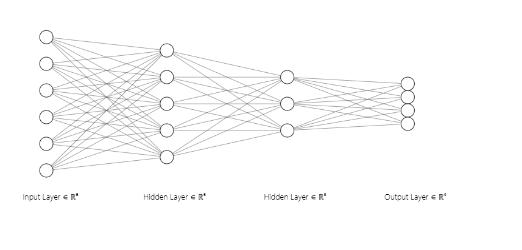
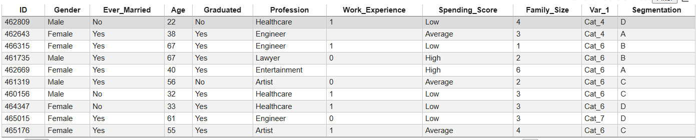
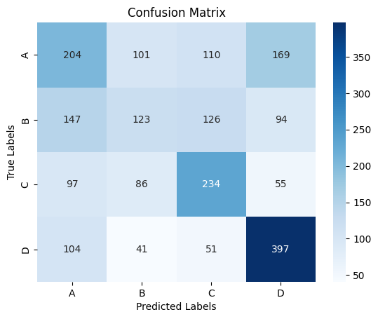
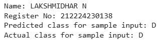

# Developing a Neural Network Classification Model

## AIM
To develop a neural network classification model for the given dataset.

## THEORY
An automobile company has plans to enter new markets with their existing products. After intensive market research, they’ve decided that the behavior of the new market is similar to their existing market.

In their existing market, the sales team has classified all customers into 4 segments (A, B, C, D ). Then, they performed segmented outreach and communication for a different segment of customers. This strategy has work exceptionally well for them. They plan to use the same strategy for the new markets.

You are required to help the manager to predict the right group of the new customers.

## Neural Network Model



## DESIGN STEPS
### STEP 1: 

Load the customer dataset and remove unnecessary columns while handling missing values.

### STEP 2: 

Encode categorical features and the target class into numerical form.

### STEP 3: 

Split the dataset into training and testing sets and normalize the features.

### STEP 4: 

Convert the data into PyTorch tensors and prepare DataLoader objects.

### STEP 5: 

Define and train a neural network model using forward pass, loss calculation, and backpropagation.

### STEP 6: 

Evaluate the trained model on test data using accuracy and classification metrics.


## PROGRAM:

### Name: LAKSHMIDHAR N

### Register Number: 212224230138

```python
class PeopleClassifier(nn.Module):
    def __init__(self, input_size):
        super(PeopleClassifier, self).__init__()
        self.fc1 = nn.Linear(input_size, 128)
        self.fc2 = nn.Linear(128, 64)
        self.fc3 = nn.Linear(64, 32)
        self.fc4 = nn.Linear(32, 16)
        self.fc5 = nn.Linear(16, 4)
    def forward(self, x):
        x = F.relu(self.fc1(x))
        x = F.relu(self.fc2(x))
        x = F.relu(self.fc3(x))
        x = F.relu(self.fc4(x))
        x = self.fc5(x)
        return x

        
# Initialize the Model, Loss Function, and Optimizer

def train_model(model, train_loader, criterion, optimizer, epochs):
  model.train()
  for epoch in range(epochs):
    for inputs, labels in train_loader:
      optimizer.zero_grad()
      outputs = model(inputs)
      loss = criterion(outputs, labels)
      loss.backward()
      optimizer.step()

    if (epoch + 1) % 10 == 0:
        print(f'Epoch [{epoch+1}/{epochs}], Loss: {loss.item():.4f}')

```

### Dataset Information



### OUTPUT:

## Confusion Matrix



## Classification Report
```
Classification Report:
               precision    recall  f1-score   support

           A       0.37      0.35      0.36       584
           B       0.35      0.25      0.29       490
           C       0.45      0.50      0.47       472
           D       0.56      0.67      0.61       593

    accuracy                           0.45      2139
   macro avg       0.43      0.44      0.43      2139
weighted avg       0.43      0.45      0.44      2139

```

### New Sample Data Prediction

#### Code:

```py
sample_input = X_test[12].clone().unsqueeze(0).detach().type(torch.float32)
with torch.no_grad():
    output = model(sample_input)
    predicted_class_index = torch.argmax(output[0]).item()
    predicted_class_label = label_encoder.inverse_transform([predicted_class_index])[0]
print("Name: LAKSHMIDHAR N")
print("Register No: 212224230138")
print(f'Predicted class for sample input: {predicted_class_label}')
print(f'Actual class for sample input: {label_encoder.inverse_transform([y_test[12].item()])[0]}')
```
#### Output:



## RESULT

The neural network successfully classified new market customers into segments A, B, C, and D based on learned patterns from existing market data. This enables accurate customer segmentation and supports targeted marketing strategies in new markets.
